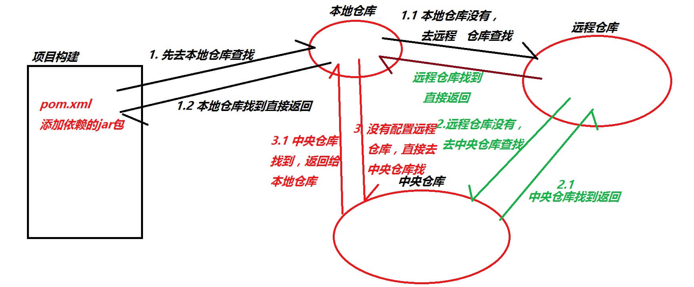
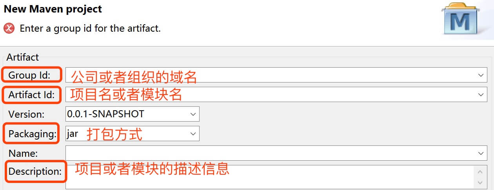

# Maven

#### 回顾

```
1. 项目中导入第三方jar包的方式
2. 项目中jar包的管理
```

#### 今天任务

```
1. Maven概述
2. Maven安装和配置
3. 使用Maven构建Web应用
5. Maven进行多模块和继承使用
```

#### 教学目标

```
1. 掌握Maven安装
2. 掌握Maven配置
3. 掌握使用Maven构建Web应用
4. 掌握Maven进行多模块和继承使用
```

###  官网地址：

http://maven.apache.org/

## 第一章 Maven概述

##### 1.1 简介

```java
    Maven是一个基于项目对象模型（POM）的概念的纯java开发的开源的项目管理工具。主要用来管理java项目，进行依赖管理(jar包管理，能自动分析项目所需的依赖软件包，并到Maven仓库区下载)和项目构建(项目打包和部署)。此外还能分块开发，提高开发效率。
```

##### 1.2 Maven目标

```xml
Maven主要目标是提供给开发人员：
      1. 项目是可重复使用，易维护，更容易理解的一个综合模型。
      2. 插件或交互的工具，这种声明性的模式。
```

## 第二章 Maven安装和配置

### 2.1 下载Maven库

```java
下载地址：http://maven.apache.org/download.cgi

备注：Maven 3.3+ require JDK 1.7 or above to execute 
```

### 2.2 解压下载库认识Maven库目录

```java
备注： 解压文件尽量不要放在含有中文或者特殊字符的目录下。
       bin:含有mvn运行的脚本
       boot:含有plexus-classworlds类加载器框架
       conf:含有settings.xml配置文件
       lib:含有Maven运行时所需要的java类库
       LICENSE.txt, NOTICE.txt, README.txt针对Maven版本，第三方软件等简要介绍
```

### 2.3 配置Maven环境变量

```
    1.右键我的电脑(或者计算机)－属性－高级系统设置－高级－环境变量－系统变量－新建MAVEN_HOME,只为maven的安装目录
    2.把%MAVEN_HOME%\bin;追加到Path变量的值后面
    3.检验是否成功：cmd-> mvn -v
    4.修改配置文件：maven安装目录下conf目录中settings.xml
```

#### 2.3.1 Eclipse配置Maven

##### 方法1：直接使用自带插件

```java
1、在 用户目录/.m2 文件夹下 创建 settings.xml 文件，配置maven仓库的位置
2、在eclipse中配置maven的用户配置文件路径，
具体如下图所示：
```


##### 方法2: 使用自己的maven文件

```
1. 首先使用自己的Maven安装文件替换掉Eclipse插件的Maven,如下图：
```


```
2.配置用户自己maven的配置文件
```


###  2.4 Maven配置文件(settings.xml)需要修改的内容

```xml
    1.localRepository:设置本地仓库：<localRepository>C:\software\repository</localRepository>
    2.mirrors:镜像路径
    <!-- 所有镜像 -->
    <!-- 阿里云仓库 -->
    <mirror>
        <id>alimaven</id>
        <mirrorOf>central</mirrorOf>
        <name>aliyun maven</name>
        <url>http://maven.aliyun.com/nexus/content/repositories/central/</url>
    </mirror>
    
    <!-- 中央仓库1 -->
    <mirror>
        <id>repo1</id>
        <mirrorOf>central</mirrorOf>
        <name>Human Readable Name for this Mirror.</name>
        <url>http://repo1.maven.org/maven2/</url>
    </mirror>
    
    <!-- 中央仓库2 -->
    <mirror>
        <id>repo2</id>
        <mirrorOf>central</mirrorOf>
        <name>Human Readable Name for this Mirror.</name>
        <url>http://repo2.maven.org/maven2/</url>
    </mirror>
```

### 2.5 Maven仓库说明

​         存储jar的仓库(3种仓库)

```java
1.本地仓库：存储在本地磁盘，默认在系统盘c盘 用户名/.m2/xx
           通过settings.xml 更改本地仓库localRepository
2.远程仓库:一般都使用国内镜像或者公司自己搭建私服.  一般用Nexus
          目的:加快下载速度
          私服存在的意义：开发者电脑更新，本地仓库就有jar。目前常用的就是阿里镜像
3.Maven(中央)仓库：Maven团队维护的jar包仓库  http://repo1.maven.org/maven2/
                  一般用这个查POM:http://mvnrepository.com/

    检索顺序:先检索本地仓库－－再检索远程仓库－－最后检索中央仓库
 具体可看下图示例
```




## 第三章 使用Maven构建Web应用

### 3.1 Eclipse创建Maven工程

```java
New ——Maven Project ——选择create a Simple Project(跳过模版)－－ 填写工程信息－－完成即可
      备注：工程创建完成后有错误，缺少web.xml文件，右键项目－JavaEE Tools-Generate Deployment
            Discriptor Stub即可生成web.xml文件。
填写的工程信息如下图：
```



### 3.2  Maven项目说明

```
      src/main/java:存放项目的.java文件
      src/main/resources:存放项目资源文件。如何Spring,Hibernate配置文件
      src/test/java:存放所有测试的.java文件.如Junit测试类
      src/test/resources:测试资源文件
      target:项目数出位置(可以自动生成)
      pom.xml(maven项目核心配置文件)
      
 pom.xml默认内容介绍：
        <!-- maven中model的版本号 -->
        <modelVersion>4.0.0</modelVersion>
        <!-- 公司名称或组织名称或者个人名称 -->
        <groupId>com.sky</groupId>
        <!--项目名称 -->
        <artifactId>FirstMaven</artifactId>
        <!-- 版本号  -->
        <version>1.0</version>
        <!-- 打包方式 ：项目类型
        POM：MAVEN项目，常用在继承和聚合上
        JAR:JAVASE项目,没有网页，跟服务器没关系
        WAR：JAVAEE项目，跟服务器没关系-->
        <packaging>war</packaging>
```

### 3.3 Maven工程添加依赖

```Xml
上网搜索依赖进行添加： 推荐网站：http://mvnrepository.com/
示例：
<dependencies>
		<!-- https://mvnrepository.com/artifact/org.hibernate/hibernate-core -->
		<dependency>
			<groupId>org.hibernate</groupId>
			<artifactId>hibernate-core</artifactId>
			<version>5.2.10.Final</version>
		</dependency>
</dependencies>
    添加到项目的pom文件内容说明(切换pom.xml到Dependencies目录下)：
        type:类型
              取值说明：
                    jar:jar包
                    Scope:声明jar包的存活时间
                  取值说明：
                        1、provided：编译和测试时需要
                        2、compile:编译、测试、运行、打包需要
                        3、runtime:测试、运行、打包需要
                        4、test:测试
                        5、system:编译和测试时需要,显示引用，Maven不会检索
```

### 3.4 修改maven工程的jdk版本号

```Xml
在指定项目的pom.xml中添加如下话语(每个maven project或者maven  model都要配置)：
<!--构建项目配置 -->
	<build>
		<!--插件 -->
		<plugins>
			<!-- java编译插件，配jdk的编译版本 -->
			<plugin>
				<groupId>org.apache.maven.plugins</groupId>
				<artifactId>maven-compiler-plugin</artifactId>
				<version>3.6.0</version>
				<configuration>
					<source>1.8</source>
					<target>1.8</target>
					<encoding>UTF-8</encoding>
				</configuration>
			</plugin>
		</plugins>
	</build>
```


## 第四章 Maven进行多模块和继承使用

```
    Maven的继承：
    
    开发中多个项目有共同的jar包依赖,可以采用继承方式简化各个项目的pom文件,在父类的pom文件中依赖共同拥有的jar.
   注意：
       1.父级项目只能是pom打包方式。
       2.子项目是一个Maven Project
  
   示例： 创建一个pom项目，然后再创建另外的jar或war项目继承pom项目
```

```
   Maven的聚合：
   
   能够把项目的各个模块聚合在一起构建。一般用于分模块开发,最后整体打包发布。
     
     Maven Model和Maven Project的区别？
          Maven Project独立运行
          Maven Model无法独立运行
   注意：
       1.根项目是一个pom项目。
       2.子模块：Maven Model
       3.每个模块写完后需要上传到私服
       4.打包，需要整体打包找到最后的war项目使用Tomcat加载
       
        实际中，我们会将一些庞大的项目拆分为若干模块进行开发
        三层+MVC 如下：
        domain-------jar
        dao----------jar
        service------jar
        web----------war
```


#### 作业

```
1. 在自己的开发工具配置Maven
2. 创建一个pom项目，并创建项目其他层（service、dao、controller等）继承pom项目
```

#### 面试题

```
1. Maven工具的作用
2. Maven如何继承，需要注意什么
```