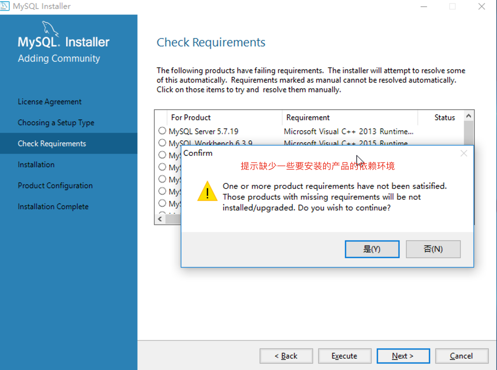
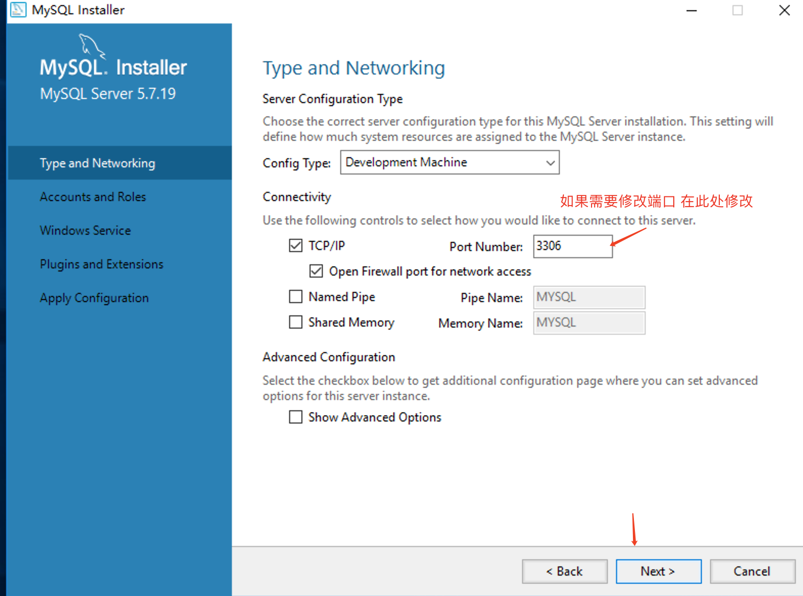
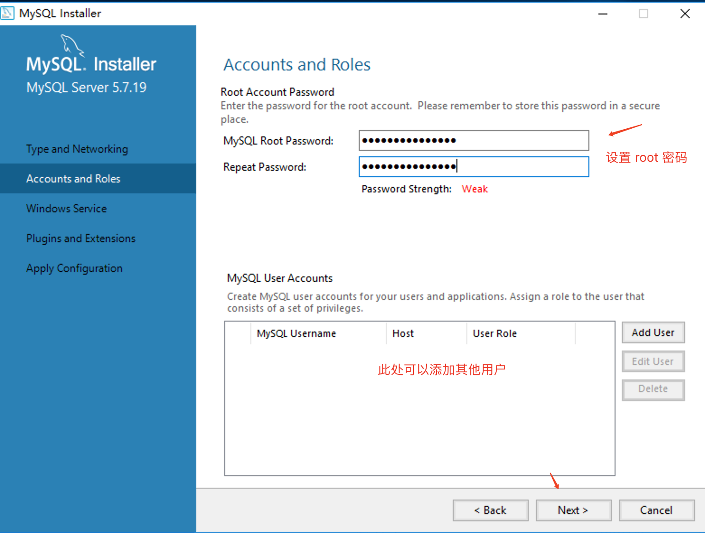
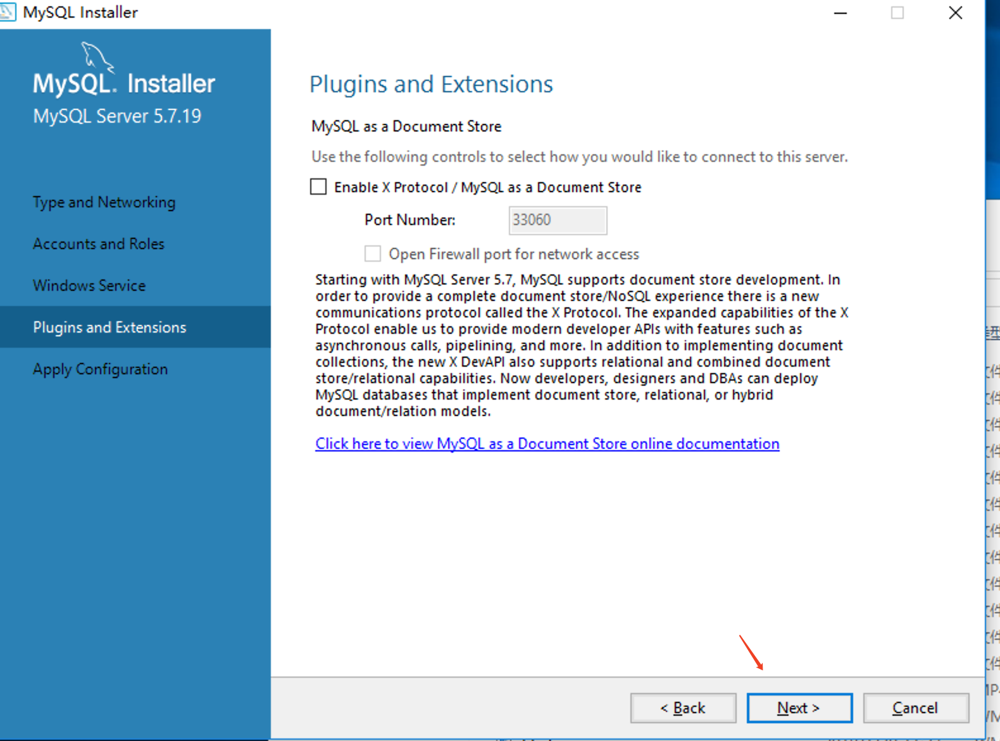

### MySQL 数据库


#### 回顾

```
JavaSE核心知识回顾：
Java语法:基本语法:变量常量  选择语句 循环 方法
面向对象：封装 继承 多态，抽象类  接口
数组 常用类 异常
集合 List Set Map
IO流 字节流 InputStream OutputStream FileInputStream FileOutputStream  BufferInputStream BufferOutputStream  字符流  Reader  Writer FileReader FileWriter BufferedReader BufferedWriter
InputStreamReader OutputStreamWriter 内存流  ByteArrayInputStream ByteArrayOutputStream
对象流:ObjectInputStream ObjectOutputStream PrintStream  随机访问文件 RandomAccessFile 装饰者设计模式
线程
  进程  线程
  创建线程方式 
  		1继承Thread类 重写run方法
  		2实现Runnable接口  run() //没有返回值 ，不能抛出异常
  		3实现Callable接口   call()  //有返回值，抛出异常,FutureTask
  线程方法：休眠 sleep  join  yield 优先级  setPrority  后台线程 setDaemon()
  线程生命周期   新生 ---可运行---运行 ----阻塞  ----死亡
  
  线程同步 : 同步代码块 synchronized(锁)  同步方法   返回值前面synchronized  非静态方法 锁this 静态方法  类名.classs
  可重入锁 ReentrantLock  lock=new ReentrantLock()
          lock.lock();
          
          lock.unlock();   
   线程通信  wait()等待  notify()唤醒   notifyAll()唤醒所有        
网络编程
    OSI参考模型
    TCP IP参考模型
    通信协议: 传输层 : TCP  UDP
             网络层 :IP  ip(地址)
    基于TCP编程 
      服务器端 
       1创建侦听套接字 ServerSocket 
       2侦听  返回客户端套接字
       3获取输入输出流
       4处理
       5关闭
     客户端
       1创建客户端套接字 指定连接的服务器的地址和端口号
       2获取输入输出流
       3处理
       4关闭
NIO
   ByteBuffer 缓冲区  position  limit  capacity
   FileChannel  文件通道
   网络编程
     Selector
     ServerSocketChannel
     SocketChannel
反射 xml解析     
```

#### 今日内容

```
1、数据库简介
2、SQL语言
3、DDL和DML语句
4、DQL数据查询
```

#### 教学目标

```
1、掌握SQL语言
2、掌握DDL和DML的使用
3、掌握DML的单表查询
```

#### 第一章 数据库简介

##### 1.1 简介

数据库（DataBase，DB）：指长期保存在计算机的存储设备上，按照一定规则组织起来，可以被各种用户或应用共享的数据集合。

数据库管理系统（DataBase Management System，DBMS）：指一种操作和管理数据库的大型软件，用于建立、使用和维护数据库，对数据库进行统一管理和控制，以保证数据库的安全性和完整性。用户通过数据库管理系统访问数据库中的数据。MySQL  SQL Server Oracle 

数据库软件应该为**数据库管理系统**，数据库是通过数据库管理系统创建和操作的。

数据库：存储、维护和管理数据的集合。

##### 1.2 常见数据库管理系统

- Oracle：Oracle数据库被认为是业界目前比较成功的关系型数据库管理系统。Oracle数据库可以运行在UNIX、Windows等主流操作系统平台，完全支持所有的工业标准，并获得最高级别的ISO标准安全性认证。
- MySQL：MySQL是一个关系型数据库管理系统，由瑞典MySQL AB 公司开发，目前属于 Oracle旗下产品。MySQL 是最流行的关系型数据库管理系统之一，在 WEB 应用方面，MySQL是最好的 RDBMS (Relational Database Management System，关系数据库管理系统) 应用软件。
- DB2：DB2是IBM公司的产品，DB2数据库系统采用多进程多线索体系结构，其功能足以满足大中公司的需要，并可灵活地服务于中小型电子商务解决方案。
- Microsoft SQL Server：SQL Server 是Microsoft 公司推出的关系型数据库管理系统。具有使用方便可伸缩性好与相关软件集成程度高等优点。

##### 1.3 MySQL安装和卸载

- 安装和配置步骤：


- 验证是否安装成功，打开cmd输入，如上图所示。

  ```sql
  c:\>mysql -u root -p
  ```

  然后输入密码，正确进入表示安装成功。

- 卸载MySQL

  1.停止服务，使用``c:\>net stop mysql``命令停止服务，``c:\>net start mysql`` 命令启动服务。

  2.在控制面板-->"程序和功能"中，找到“mysql程序”，点击卸载。

  3.删除安装目录,一般默认在C:\Program Files\MySQL。

  4.删除数据库文件存放目录，一般默认在C:\ProgramData\MySQL。


##### 1.4 MySQL5.7.x 版本安装

> 同意协议


> 开发模式


> 请注意安装需要的依赖环境,如果想安装的功能缺少对应环境是无法安装的,需先安装环境后才可以安装


> 下一步的时候会提示缺少环境,此处的提示是说你期望安装的产品中缺少依赖,不一定提示的是数据库服务器安装的依赖,可能是其他功能组件的依赖缺少




> 此处发现没有 mysql server, 说明它对应的依赖缺少,可以先执行安装这些可以安装的,之后安装完依赖后再重新安装其他模块,我们此处的操作是先安装依赖,然后后退再次安装


> 下载安装前面提示的 mysql server 需要的 vc2013后,vc2013 如果在64位系统上面建议32和64的程序都安装,然后在上图的地方后退,重新 next 就可以看到可以安装 mysql server 了


> 进行第一步配置,除了需要设置密码外,后面的步骤基本上都是下一步下一步





> 设置 root 密码







> finish 后回到当前页面继续配置


> 此处先 check, 后下一步


> 执行完此步骤 下一步 finish 配置完成


####第二章 SQL语言

##### 2.1 概述

​	 SQL：Structure Query Language（结构化查询语言），SQL被美国国家标准局（ANSI）确定为关系型数据库语言的美国标准，后来被国际化标准组织（ISO）采纳为关系数据库语言的国际标准。

​	各数据库厂商都支持ISO的SQL标准，**普通话**

​	各数据库厂商在标准的基础上做了自己的扩展，**方言**

​         SQL 是一种标准化的语言，它允许你在数据库上执行操作，如创建项目，查询内容，更新内容，并删除条目等操作。

​         Create, Read, Update, and Delete 通常称为CRUD操作。

##### 2.2 SQL语句分类          

- DDL（Data Definition Language）：数据定义语言，用来定义数据库对象：库、表、列等。
- DML（Data Manipulation Language）：数据操作语言，用来定义数据库记录（数据）。
- DCL（Data Control Language）：数据控制语言，用来定义访问权限和安全级别。
- DQL（Data Query Language）：数据查询语言，用来查询记录（数据）。

​        注意sql语句以;结尾，有一些命令不用;

* MySQL注释：（1）#开头 （2）--空格 开头


##### 2.3 DDL操作数据库

1创建数据库：CREATE DATABASE语句用于创建新的数据库：

```sql
SQL> CREATE DATABASE mydb1;
SQL> CREATE DATABASE mydb2 character SET GBK;
SQL> CREATE DATABASE mydb3 character SET GBK COLLATE gbk_chinese_ci;
```

2查看

查看当前数据库服务器中的所有数据库

```sql
SQL> SHOW DATABASES;
```

​	查看前面创建的mydb2数据库的定义信息

```sql
SQL> Show CREATE DATABASE mydb2;
```

3修改

查看服务器中的数据库，并把mydb2的字符集修改为utf8;

```sql
SQL> ALTER DATABASE mydb2 character SET utf8;
```

4删除

```sql
SQL> DROP DATABASE mydb3;
```

5其他语句

​	查看当前使用的数据库

```sql
SQL> Select database(); #没有选择数据 null
```

​	切换数据库

```sql
SQL> USE mydb2;
```

##### 2.4 DDL操作表

CREATE TABLE语句用于创建新表。

语法： 

CREATE TABLE 表名(

​                                  字段1 字段类型(长度) 约束,

​                                  字段2 字段类型(长度) 约束,

​                                  ...

​                                  字段n 字段类型(长度) 约束

​                         );

示例：

```sql
SQL> CREATE TABLE Employees
(
   id INT NOT NULL,
   age INT NOT NULL,
   first VARCHAR(255),
   last VARCHAR(255)
);
```

常用数据类型：

​                         int：整型

​                         double：浮点型，例如double(5,2)表示最多5位，其中必须有2位小数，即最大值为999.99；

​                         char：固定长度字符串类型；    char(10)    'aaa       '  占10位

​                         varchar：可变长度字符串类型； varchar(10)  'aaa'  占3位

​                         text：大文本字符串类型；有字符编码，存储比较大的文本数据。

​                         blob：大字节类型数据；可以存储图片、音频、视频

​                         date：日期类型，格式为：yyyy-MM-dd；

​                         time：时间类型，格式为：hh:mm:ss

​                         timestamp：时间戳类型 yyyy-MM-dd hh:mm:ss  会自动赋值

​                         datetime:日期时间类型 yyyy-MM-dd hh:mm:ss

常用约束：

​			主键约束：primary key (保证数据唯一性)

​			唯一约束：unique [key]

 			非空约束：not null

​			默认约束：default 

​			外键约束：foreign key

​			自动增长：auto_increment

DROP TABLE语句用于删除现有表。

```sql
SQL> DROP TABLE table_name;
```

当前数据库中的所有表

SHOW TABLES;

查看表的字段信息

DESC employee;

在上面员工表的基本上增加一个image列。

ALTER TABLE employee ADD image blob;

修改job列，使其长度为60。

ALTER TABLE employee MODIFY job varchar(60);

删除image列,一次只能删一列。

ALTER TABLE employee DROP image;

表名改为user。

RENAME TABLE employee TO user;

查看表的创建细节

SHOW CREATE TABLE user;

修改表的字符集为gbk

ALTER TABLE user CHARACTER SET gbk;

列名name修改为username

ALTER TABLE user CHANGE name username varchar(100);


##### 2.5 DML操作（重要）

DML是对表中的数据进行增、删、改的操作。不要与DDL混淆了。

主要包括：INSERT 、UPDATE、 DELETE

小知识：

<u>在mysql中，字符串类型和日期类型都要用单引号括起来。</u>

<u>空值：null</u>

**（1）插入操作：INSERT:**

​	语法： INSERT INTO 表名（列名1，列名2 ...）VALUES(列值1，列值2...);

​	注意：列名与列值的类型、个数、顺序要一一对应。

​	可以把列名当做java中的形参，把列值当做实参。

​	参数不要超出列定义的长度。

​	如果插入空值，请使用null

​	插入的日期和字符一样，都使用单引号括起来。

练习 ：

create table emp(

​	id int primary key,

​	name varchar(100) not null,

​	gender varchar(10) not null,

​	birthday date,

​	salary float(10,2),

​	entry_date date,

​	resume text

);

一次添加一条数据

INSERT INTO emp(id,name,gender,birthday,salary,entry_date,resume)

VALUES(1,'zhangsan','female','1990-5-10',10000,'2015-5-5-','goodgirl');

 

INSERT INTO emp(id,name,gender,birthday,salary,entry_date,resume)

VALUES(2,'lisi','male','1995-5-10',10000,'2015-5-5','good boy');

 

INSERT INTO emp(id,name,gender,birthday,salary,entry_date,resume)

VALUES(3,'你好','male','1995-5-10',10000,'2015-5-5','good boy');


一次添加多条数据

INSERT INTO emp(id,name,gender,birthday,salary,entry_date,resume)

VALUES  (4,'你好','male','1995-5-10',10000,'2015-5-5','good boy'),

​		(5,'你好','male','1995-5-10',10000,'2015-5-5','good boy'),

​	 	(6,'你好','male','1995-5-10',10000,'2015-5-5','good boy');


小知识：

查看数据库编码的具体信息

​	Show variables like ‘character%’;

临时更改客户端和服务器结果集的编码 

Set character_set_client=gbk;

Set character_set_results=gbk;

或者

SET  NAMES  ‘gbk’;  // client  connection results

**（2）修改操作：UPDATE:**

语法：UPDATE 表名 SET 列名1=列值1,列名2=列值2 ... WHERE 列名=值

练习：

将所有员工薪水修改为5000元。

​	UPDATE emp SET salary=5000 

将姓名为’zhangsan’的员工薪水修改为3000元。

​	UPDATE emp SET salary=3000 WHERE name=’ zhangsan’;

将姓名为’lisi'’的员工薪水修改为4000元,性别改为‘female’。

​	UPDATE emp SET salary=4000,gender='female' WHERE name='lisi';

将wangwu的薪水在原有基础上增加1000元。

 	UPDATE emp SET salary=salary+1000 WHERE name='wangwu';        

**（3）删除操作：DELETE:**

语法 ： DELETE from 表名 【WHERE 列名=值】

练习 ：

删除表中名称为’zhangsan’的记录。

DELETE FROM emp WHERE name=‘zhangsan’;

删除表中所有记录。

DELETE FROM emp;

使用truncate删除表中记录。(先把表删除，然后再创建空表)

TRUNCATE TABLE emp;

- DELETE 删除表中的数据，表结构还在;删除后的数据使用日志可以找回。
- TRUNCATE 删除是把表直接DROP掉，然后再创建一个同样的新表。
- TRUNCATE 删除的数据不能找回。执行速度比DELETE快。


#### 第三章 DQL数据查询(重点)

数据库执行DQL语句不会对数据进行改变，而是让数据库发送结果集给客户端。

查询返回的结果集是一张虚拟表。

**查询关键字：SELECT** 

语法： SELECT 列名 FROM 表名 【WHERE --> GROUP BY-->HAVING--> ORDER BY-->LIMIT】

SELECT selection_list /*要查询的列名称*/

  FROM table_list /*要查询的表名称*/

  WHERE condition /*行条件*/

  GROUP BY grouping_columns /*对结果分组*/

  HAVING condition /*分组后的行条件*/

  ORDER BY sorting_columns /*对结果排序*/

  LIMIT offset_start, row_count /*结果限定*/

**示例操作：**

​	1>创建学生表并添加数据

```sql
#创建表stu
CREATE TABLE stu (
	sid	CHAR(6),
	sname		VARCHAR(50),
	age		INT,
	gender	VARCHAR(50)
);
#添加数据
INSERT INTO stu VALUES('S_1001', 'liuYi', 35, 'male');
INSERT INTO stu VALUES('S_1002', 'chenEr', 15, 'female');
INSERT INTO stu VALUES('S_1003', 'zhangSan', 95, 'male');
INSERT INTO stu VALUES('S_1004', 'liSi', 65, 'female');
INSERT INTO stu VALUES('S_1005', 'wangWu', 55, 'male');
INSERT INTO stu VALUES('S_1006', 'zhaoLiu', 75, 'female');
INSERT INTO stu VALUES('S_1007', 'sunQi', 25, 'male');
INSERT INTO stu VALUES('S_1008', 'zhouBa', 45, 'female');
INSERT INTO stu VALUES('S_1009', 'wuJiu', 85, 'male');
INSERT INTO stu VALUES('S_1010', 'zhengShi', 5, 'female');
INSERT INTO stu VALUES('S_1011', 'xxx', NULL, NULL);
```

2>创建雇员表并添加数据

```sql
#创建雇员表
CREATE TABLE emp(
	empno		INT,
	ename		VARCHAR(50),
	job		VARCHAR(50),
	mgr		INT,
	hiredate	DATE,
	sal		DECIMAL(7,2),
	comm		decimal(7,2),
	deptno		INT
);
#添加数据
INSERT INTO emp values(7369,'SMITH','CLERK',7902,'1980-12-17',800,NULL,20);
INSERT INTO emp values(7499,'ALLEN','SALESMAN',7698,'1981-02-20',1600,300,30);
INSERT INTO emp values(7521,'WARD','SALESMAN',7698,'1981-02-22',1250,500,30);
INSERT INTO emp values(7566,'JONES','MANAGER',7839,'1981-04-02',2975,NULL,20);
INSERT INTO emp values(7654,'MARTIN','SALESMAN',7698,'1981-09-28',1250,1400,30);
INSERT INTO emp values(7698,'BLAKE','MANAGER',7839,'1981-05-01',2850,NULL,30);
INSERT INTO emp values(7782,'CLARK','MANAGER',7839,'1981-06-09',2450,NULL,10);
INSERT INTO emp values(7788,'SCOTT','ANALYST',7566,'1987-04-19',3000,NULL,20);
INSERT INTO emp values(7839,'KING','PRESIDENT',NULL,'1981-11-17',5000,NULL,10);
INSERT INTO emp values(7844,'TURNER','SALESMAN',7698,'1981-09-08',1500,0,30);
INSERT INTO emp values(7876,'ADAMS','CLERK',7788,'1987-05-23',1100,NULL,20);
INSERT INTO emp values(7900,'JAMES','CLERK',7698,'1981-12-03',950,NULL,30);
INSERT INTO emp values(7902,'FORD','ANALYST',7566,'1981-12-03',3000,NULL,20);
INSERT INTO emp values(7934,'MILLER','CLERK',7782,'1982-01-23',1300,NULL,10);
```

3>创建部门表并添加数据

```sql
#创建部门表
CREATE TABLE dept(
	deptno		INT,
	dname		varchar(14),
	loc		varchar(13)
);
#添加数据
INSERT INTO dept values(10, '财务部', 'beijing');
INSERT INTO dept values(20, 'java开发部', 'tianjin');
INSERT INTO dept values(30, '测试部', 'shanghai');
INSERT INTO dept values(40, '销售部', 'shenzheng');
```

##### 3.1 简单查询

查询所有列  *表示所有列

```sql
SELECT * FROM stu;
```

查询指定列

```sql
SELECT sid, sname, age FROM stu;
```

##### 3.2 条件查询

条件查询就是在查询时给出WHERE子句，在WHERE子句中可以使用如下运算符及关键字：

**比较运算符**

l  =、!=、<>、<、<=、>、>=；

l  BETWEEN…AND；

l  IN(set)；

l  IS NULL；  

**关系运算符**

l  AND；

l  OR；

l  NOT；

**算术运算符:**

```
+  -  *  /  %
```


(1)查询性别为女，并且年龄小于50的记录

```sql
SELECT * FROM stu WHERE gender='female' AND age<50;
```

(2)查询学号为S_1001，或者姓名为liSi的记录

```sql
SELECT * FROM stu WHERE sid ='S_1001' OR sname='liSi';
```

(3)查询学号为S_1001，S_1002，S_1003的记录

```sql
SELECT * FROM stu 
WHERE sid IN ('S_1001','S_1002','S_1003');
等同于
SELECT * FROM stu 
WHERE sid='S_1001' or sid='S_1002' or sid='S_1003';
```

(4)查询学号不是S_1001，S_1002，S_1003的记录

```sql
SELECT * FROM tab_student 
WHERE sid NOT IN('S1001','S1002','S_1003');
```

(5)查询年龄为null的记录

```sql
SELECT * FROM stu WHERE age IS NULL;
```

(6)　查询年龄在20到40之间的学生记录

```sql
SELECT * 

FROM stu

WHERE age>=20 AND age<=40;
```

或者

```sql
SELECT * 

FROM stu 

WHERE age BETWEEN 20 AND 40;
```

(7)　查询性别非男的学生记录

```sql
SELECT * 

FROM stu

WHERE gender!='male';
```

或者

```sql
SELECT * 
FROM stu
WHERE gender<>'male';
```

或者

```sql
SELECT * 

FROM stu

WHERE NOT gender='male';
```

(8) 查询姓名不为null的学生记录

```sql
SELECT * 

FROM stu

WHERE NOT sname IS NULL;
```

或者

```sql
SELECT * 
FROM stu
WHERE sname IS NOT NULL;
```

##### 3.3 模糊查询

当想查询姓名中包含a字母的学生时就需要使用模糊查询了。模糊查询需要使用关键字LIKE。

通配符: 

​	_ 任意一个字符

​      %：任意0~n个字符

 '张%'  ---》张三丰  张三  张无忌

 '李_'  --->李四  李逵  李刚 

(1)查询姓名由3个字符构成的学生记录

```sql
SELECT * 

FROM stu

WHERE sname LIKE '___';
```

模糊查询必须使用LIKE关键字。其中 “_”匹配任意一个字母，5个“_”表示5个任意字母。

(2)查询姓名由5个字符构成，并且第5个字符为“i”的学生记录

```sql
SELECT * 

FROM stu

WHERE sname LIKE '____i';
```

(3)查询姓名以“z”开头的学生记录

```sql
SELECT * 

FROM stu

WHERE sname LIKE 'z%';
```

其中“%”匹配0~n个任何字符。

(4)查询姓名中第2个字符为“i”的学生记录

```sql
SELECT * 

FROM stu

WHERE sname LIKE '_i%'; 
```

(5)查询姓名中包含“a”字符的学生记录

```sql
SELECT * 

FROM stu

WHERE sname LIKE '%a%';
```

##### 3.4 字段控制查询

(1)去除重复记录

去除重复记录（两行或两行以上记录中系列的上的数据都相同），例如emp表中sal字段就存在相同的记录。当只查询emp表的sal字段时，那么会出现重复记录，那么想去除重复记录，需要使用DISTINCT：

```sql
SELECT DISTINCT sal FROM emp;
SELECT DISTINCT sal,com FROM emp;
```

(2)查看雇员的月薪与佣金之和

　	因为sal和comm两列的类型都是数值类型，所以可以做加运算。如果sal或comm中有一个字段不是数值类型，那么会出错。

```sql
SELECT *,sal+comm FROM emp;

字符串的合并不能使用+ ,使用concat(ename,'____',job);
select *,concat(ename,'______',job) from emp;
```

comm列有很多记录的值为NULL，因为任何东西与NULL相加结果还是NULL，所以结算结果可能会出现NULL。下面使用了把NULL转换成数值0的函数IFNULL：

```sql
SELECT *,sal+IFNULL(comm,0) FROMemp;

```

(3)给列名添加别名

在上面查询中出现列名为sal+IFNULL(comm,0)，这很不美观，现在我们给这一列给出一个别名，为total：

```sql
SELECT *, sal+IFNULL(comm,0) AS total FROM emp;
```

给列起别名时，是可以省略AS关键字的：

```sql
SELECT *,sal+IFNULL(comm,0)  total FROM emp;
```

##### 3.5 排序

(1)　查询所有学生记录，按年龄升序排序

```sql
SELECT *

FROM stu

ORDER BY age ASC;
```

或者

```sql
SELECT *

FROM stu

ORDER BY age;
```

(2)　查询所有学生记录，按年龄降序排序

```sql
SELECT *

FROM stu

ORDER BY age DESC;
```

(3)　查询所有雇员，按月薪降序排序，如果月薪相同时，按编号升序排序

```sql
SELECT * FROM emp

ORDER BY sal DESC,empno ASC; 
```

##### 3.6 聚合函数  

聚合函数是用来做纵向运算的函数：

l  COUNT()：统计指定列不为NULL的记录行数；

l  MAX()：计算指定列的最大值，如果指定列是字符串类型，那么使用字符串排序运算；

l  MIN()：计算指定列的最小值，如果指定列是字符串类型，那么使用字符串排序运算；

l  SUM()：计算指定列的数值和，如果指定列类型不是数值类型，那么计算结果为0；

l  AVG()：计算指定列的平均值，如果指定列类型不是数值类型，那么计算结果为0；

(1)　COUNT

当需要纵向统计时可以使用COUNT()。

l  查询emp表中记录数：

```sql
SELECT COUNT(*) AS cnt FROM emp;
```

l  查询emp表中有佣金的人数：

```sql
SELECT COUNT(comm) cnt FROM emp;
```

注意，因为count()函数中给出的是comm列，那么只统计comm列非NULL的行数。

l  查询emp表中月薪大于2500的人数：

```sql
SELECT COUNT(*) FROM emp

WHERE sal > 2500;
```

l  统计月薪与佣金之和大于2500元的人数：

```sql
SELECT COUNT(*) AS cnt FROM empWHERE sal+IFNULL(comm,0) > 2500;
```

l  查询有佣金的人数，以及有领导的人数：

```sql
SELECT COUNT(comm), COUNT(mgr)FROM emp;
```

(2)　SUM和AVG

当需要纵向求和时使用sum()函数。

l  查询所有雇员月薪和：

```sql
SELECT SUM(sal) FROM emp;
```

l  查询所有雇员月薪和，以及所有雇员佣金和：

```sql
SELECT SUM(sal), SUM(comm) FROMemp;
```

l  查询所有雇员月薪+佣金和：

```sql
SELECT SUM(sal+IFNULL(comm,0))FROM emp;
```

l  统计所有员工平均工资：

```sql
SELECT AVG(sal) FROM emp;
```

(3)　MAX和MIN

l  查询最高工资和最低工资：

```sql
SELECT MAX(sal), MIN(sal) FROMemp;
```

##### 3.7 分组查询

当需要分组查询时需要使用GROUP BY子句，例如查询每个部门的工资和，这说明要使用部分来分组。

注：凡和聚合函数同时出现的列名，则一定要写在group by 之后

###### 3.7.1 分组查询

l  查询每个部门的部门编号和每个部门的工资和：

```sql
SELECT deptno, SUM(sal)

FROM emp

GROUP BY deptno;
```

l  查询每个部门的部门编号以及每个部门的人数：

```sql
SELECT deptno,COUNT(*)

FROM emp

GROUP BY deptno;
```

l  查询每个部门的部门编号以及每个部门工资大于1500的人数：

```sql
SELECT deptno,COUNT(*)

FROM emp

WHERE sal>1500

GROUP BY deptno;
```

###### 3.7.2 HAVING子句

l  查询工资总和大于9000的部门编号以及工资和：

```sql
SELECT deptno, SUM(sal)

FROM emp

GROUP BY deptno

HAVING SUM(sal) > 9000;
```

​      注：having与where的区别:

   	1.having是在分组后对数据进行过滤,where是在分组前对数据进行过滤             

​	2.having后面可以使用分组函数(统计函数)

​         where后面不可以使用分组函数。

​	WHERE是对分组前记录的条件，如果某行记录没有满足WHERE子句的条件，那么这行记录不会参加分组；而		HAVING是对分组后数据的约束。

##### 3.8 LIMIT

LIMIT用来限定查询结果的起始行，以及总行数。

1查询5行记录，起始行从0开始

```sql
SELECT * FROM emp LIMIT 0, 5;
```

注意，起始行从0开始，即第一行开始！

2查询10行记录，起始行从3开始

```sql
SELECT* FROM emp LIMIT 3, 10;
```

###### 3.8.3 分页查询

如果一页记录为10条，希望查看第3页记录应该怎么查呢？

l  第一页记录起始行为0，一共查询10行；

l  第二页记录起始行为10，一共查询10行；

l  第三页记录起始行为20，一共查询10行；

​        查询语句书写顺序：select – from- where- groupby- having- order by-limit

​        查询语句执行顺序：from - where -group by -having - select - order by-limit        

#### 第四章 客户端工具的使用

使用命令虽然可以完成基本操作，为了更方便用户操作和使用MySQL数据，市面上出现很多第三方的客户端管理工具比如:SQLyog和Navicat 


#### 总结

##### 

#### 作业题

```
1.设有成绩表如下所示
    1.查询两门及两门以上不及格的学生姓名
    2.查询学生平均分
    3.查询姓名是张三的学生 成绩和
    4.将学生信息按照 分数倒序
    5.获取学生信息中 分数最低的学生姓名和分数最高的学生姓名
    6.查询两门及两门以上不及格同学的平均分。
    编号	姓名	科目	分数
    1	张三	数学	90
    2	张三	语文	50
    3	张三	地理	40
    4	李四	语文	55
    5	李四	政治	45
    6	王五	政治	30
    7	李四	数学	80
    8	王五	语文	70

2.写出 SQL语句的格式 : 插入 ，更新 ，删除 
  表名 user
  name	tel	content	date
  张三	13333663366	大专毕业	2006-10-11 张三	13612312331	本科毕业	2006-10-15 张四	021-55665566	中专毕业	2006-10-15
  (a).有一新记录(小王 13254748547 高中毕业 2007-05-06)请用SQL语句新增至表中
  (b).请用sql语句把张三的时间更新成为当前系统时间 
  (c).请写出删除名为张四的全部记录
3.写出 SQL语句的格式 :对emp表进行查询操作
  1.找出奖金高于工资的雇员 
  2.找出奖金高于工资60%的雇员
  3.找出部门10中所有经理和部门20中所有店员的信息
  4.找出部门10中所有经理(MANAGER)，部门20中所有店员，既不是经理又不是店员但其5.薪资大于或等于2000的所有员工的信息。
  6.查询没有奖金或者奖金低于100的员工信息
  7.查询姓名不带”R”的员工姓名
  8.显示员工的姓名和入职时间，根据入职时间，将最老的员工排放在最前面。
  9.显示所有员工的姓名、工作和工资，按照工作的降序排序，若工作相同则按工资升序排序。
```

#### 面试题

```
有3 个表（15 分钟）：【基础】
Student 学生表(学号，姓名，性别，年龄，组织部门)
Course 课程表(编号，课程名称)
Sc 选课表(学号，课程编号，成绩)
表结构如下：
1）写一个SQL 语句，查询选修了’计算机原理’的学生学号和姓名（3 分钟）
2）写一个SQL 语句，查询’周星驰’同学选修了的课程名字（3 分钟）
3）写一个SQL 语句，查询选修了5 门课程的学生学号和姓名（9 分钟）
```
