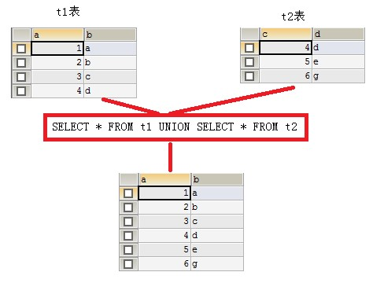
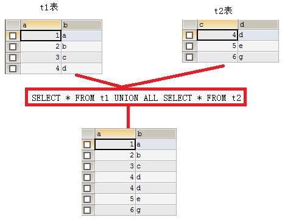
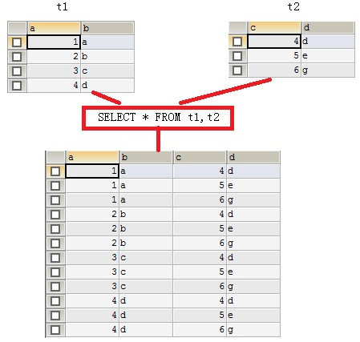
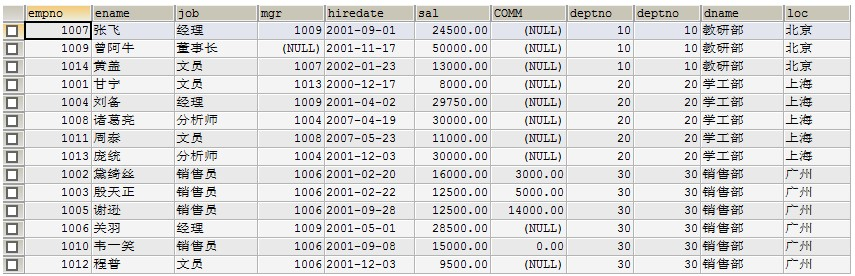
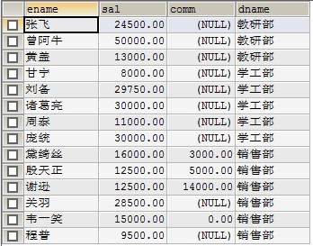
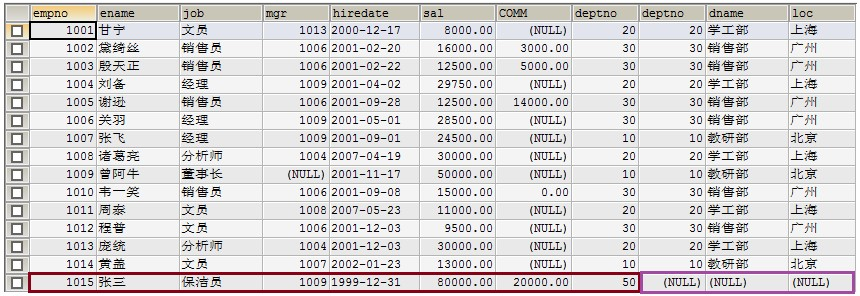
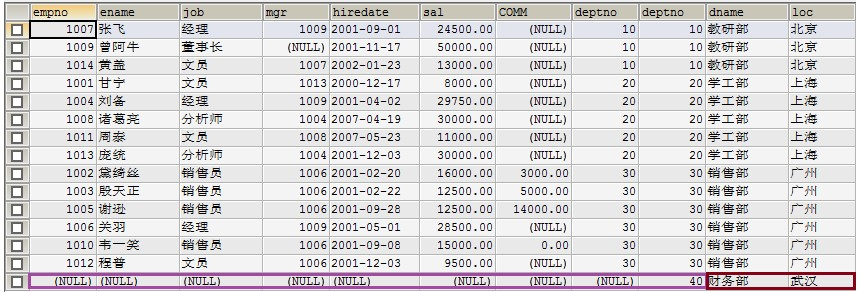
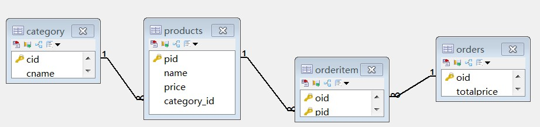

### MySQL 数据库


#### 课程回顾

```
1、数据库概述
2、SQL语言分类
3、常用的SQL语句
```

#### 今日内容

```
1、数据库完整性(约束)
2、多表查询
3、综合练习
```

#### 教学目标

```
1、掌握SQL语言数据的完整性
2、掌握内连接
3、掌握外连接
4、掌握子查询
```


#### 第四章 数据的完整性

作用：保证用户输入的数据保存到数据库中是正确的。

确保数据的完整性 = 在创建表时给表中添加约束

完整性的分类：

- 实体完整性:
- 域完整性:
- 引用完整性:  学生表(学号 ,姓名)   成绩表( 学号,科目,成绩)

##### 4.1 实体完整性

实体：即表中的一行(一条记录)代表一个实体（entity）

实体完整性的作用：标识每一行数据不重复。

约束类型：

**主键约束（primary key）** 

 **唯一约束(unique)**  

**自动增长列(auto_increment)**

###### 4.1.1 主键约束（primary key）

​	注：每个表中要有一个主键。

​	特点：数据唯一，且不能为null

示例：

第一种添加方式：

```sql
CREATE TABLE student(
id int primary key,
name varchar(50)
);
```

第二种添加方式：此种方式优势在于，可以创建联合主键

```sql
CREATE TABLE student(
id int,
name varchar(50),
primary key(id)
);
```

```sql
CREATE TABLE student(
classid int,
stuid int,
name varchar(50),
primary key(classid，stuid)
);
```

第三种添加方式：

```sql
CREATE TABLE student(
id int,
name varchar(50)
);
ALTER TABLE student  ADD  PRIMARY KEY (id);
```

###### 4.1.2 唯一约束(unique)      

特点：数据不能重复。可以为null

```sql
CREATE TABLE student(
Id int primary key,
Name varchar(50) unique
);
```

###### 4.1.3 自动增长列(auto_increment)  

 sqlserver数据库 (identity)  oracle数据库( sequence)

给主键添加自动增长的数值，列只能是整数类型

```sql
CREATE TABLE student(
Id int primary key auto_increment,
Name varchar(50)
);
INSERT INTO student(name) values(‘tom’);
```

##### 4.2 域完整性

域完整性的作用：限制此单元格的数据正确，不对照此列的其它单元格比较

域代表当前单元格

域完整性约束：数据类型、非空约束（not null）、默认值约束(default)  

check约束（mysql不支持）check(sex='男'or  sex='女')

###### 4.2.1 数据类型

数值类型

| 类型               | 大小                              | 范围（有符号）                                  | 范围（无符号）                                  | 用途      |
| ---------------- | ------------------------------- | ---------------------------------------- | ---------------------------------------- | ------- |
| TINYINT          | 1 字节                            | (-128，127)                               | (0，255)                                  | 小整数值    |
| SMALLINT         | 2 字节                            | (-32 768，32 767)                         | (0，65 535)                               | 大整数值    |
| MEDIUMINT        | 3 字节                            | (-8 388 608，8 388 607)                   | (0，16 777 215)                           | 大整数值    |
| **INT或INTEGER**  | 4 字节                            | (-2 147 483 648，2 147 483 647)           | (0，4 294 967 295)                        | 大整数值    |
| BIGINT           | 8 字节                            | (-9 233 372 036 854 775 808，9 223 372 036 854 775 807) | (0，18 446 744 073 709 551 615)           | 极大整数值   |
| FLOAT            | 4 字节                            | (-3.402 823 466 E+38，-1.175 494 351 E-38)，0，(1.175 494 351 E-38，3.402 823 466 351 E+38) | 0，(1.175 494 351 E-38，3.402 823 466 E+38) | 单精度浮点数值 |
| DOUBLE           | 8 字节                            | (-1.797 693 134 862 315 7 E+308，-2.225 073 858 507 201 4 E-308)，0，(2.225 073 858 507 201 4 E-308，1.797 693 134 862 315 7 E+308) | 0，(2.225 073 858 507 201 4 E-308，1.797 693 134 862 315 7 E+308) | 双精度浮点数值 |
| **DOUBLE(M,D)**  | 8个字节，M表示长度，D表示小数位数              | 同上，受M和D的约束   DUBLE(5,2) -999.99-999.99   | 同上，受M和D的约束                               | 双精度浮点数值 |
| **DECIMAL(M,D)** | 对DECIMAL(M,D) ，如果M>D，为M+2否则为D+2 | 依赖于M和D的值，M最大值为65                         | 依赖于M和D的值，M最大值为65                         | 小数值     |

日期类型:

表示时间值的日期和时间类型为DATETIME、DATE、TIMESTAMP、TIME和YEAR。

每个时间类型有一个有效值范围和一个"零"值，当指定不合法的MySQL不能表示的值时使用"零"值。

TIMESTAMP类型有专有的自动更新特性

| 类型           | 大小(字节) | 范围                                       | 格式                  | 用途           |
| ------------ | ------ | ---------------------------------------- | ------------------- | ------------ |
| **DATE**     | 3      | 1000-01-01/9999-12-31                    | YYYY-MM-DD          | 日期值          |
| TIME         | 3      | '-838:59:59'/'838:59:59'                 | HH:MM:SS            | 时间值或持续时间     |
| YEAR         | 1      | 1901/2155                                | YYYY                | 年份值          |
| **DATETIME** | 8      | 1000-01-01 00:00:00/9999-12-31 23:59:59  | YYYY-MM-DD HH:MM:SS | 混合日期和时间值     |
| TIMESTAMP    | 4      | 1970-01-01 00:00:00/2038 结束时间是第 **2147483647** 秒，北京时间 **2038-1-19 11:14:07**，格林尼治时间 2038年1月19日 凌晨 03:14:07 | YYYYMMDD HHMMSS     | 混合日期和时间值，时间戳 |

字符串类型:

字符串类型指CHAR、VARCHAR、BINARY、VARBINARY、BLOB、TEXT、ENUM和SET

| 类型                            | 大小                | 用途                        |
| ----------------------------- | ----------------- | ------------------------- |
| **CHAR**                      | 0-255字符           | 定长字符串  char(10) 10个字符     |
| **VARCHAR**                   | 0-65535 字节        | 变长字符串  varchar(10)  10个字符 |
| TINYBLOB                      | 0-255字节           | 不超过 255 个字符的二进制字符串        |
| TINYTEXT                      | 0-255字节           | 短文本字符串                    |
| **BLOB**（binary large object） | 0-65 535字节        | 二进制形式的长文本数据               |
| **TEXT**                      | 0-65 535字节        | 长文本数据                     |
| MEDIUMBLOB                    | 0-16 777 215字节    | 二进制形式的中等长度文本数据            |
| MEDIUMTEXT                    | 0-16 777 215字节    | 中等长度文本数据                  |
| LONGBLOB                      | 0-4 294 967 295字节 | 二进制形式的极大文本数据              |
| LONGTEXT                      | 0-4 294 967 295字节 | 极大文本数据                    |

CHAR和VARCHAR类型类似，但它们保存和检索的方式不同。它们的最大长度和是否尾部空格被保留等方面也不同。在存储或检索过程中不进行大小写转换。

BINARY和VARBINARY类类似于CHAR和VARCHAR，不同的是它们包含二进制字符串而不要非二进制字符串。也就是说，它们包含字节字符串而不是字符字符串。这说明它们没有字符集，并且排序和比较基于列值字节的数值值。

BLOB是一个二进制大对象，可以容纳可变数量的数据。有4种BLOB类型：TINYBLOB、BLOB、MEDIUMBLOB和LONGBLOB。它们只是可容纳值的最大长度不同。

有4种TEXT类型：TINYTEXT、TEXT、MEDIUMTEXT和LONGTEXT。这些对应4种BLOB类型，有相同的最大长度和存储需求。

###### 4.2.2 非空约束

not null

```sql
CREATE TABLE student(
Id int pirmary key,
Name varchar(50) not null,
Sex varchar(10)
);
INSERT INTO student values(1,’tom’,null);
```

###### 4.2.3 默认值约束 

default

```sql
CREATE TABLE student(
Id int pirmary key,
Name varchar(50) not null,
Sex varchar(10) default '男'
);
insert intostudent1 values(1,'tom','女');
insert intostudent1 values(2,'jerry',default);
```

##### 4.3 引用完整性

（参照完整性）

```
外键约束：FOREIGN KEY 
```

示例：

```sql
#学生表
CREATE TABLE student(
sid int pirmary key,
name varchar(50) not null,
sex varchar(10) default '男'
);
```

```sql
#成绩表
create table score(
        id int,
        score int,
        sid int , 
        CONSTRAINT fk_score_sid foreign key(sid) references student(id)
);

第二种写法（简写）
create table score(
        id int,
        score int,
        sid int references student(id)
);
-- 外键列的数据类型一定要与主键的类型一致
```

第二种添加外键方式。

```sql
ALTER TABLE score1 ADD CONSTRAINT fk_stu_score FOREIGN KEY(sid) REFERENCES stu(id);
```


#### 第五章 多表查询

多个表之间是有关系的，那么关系靠谁来维护?

多表约束：外键约束。

##### 5.1 多表的关系

###### 5.1.1 一对多关系

客户和订单，分类和商品，部门和员工.

一对多建表原则：在多的一方创建一个字段，字段作为外键指向一的一方的主键.

###### 5.1.2 多对多关系

学生和课程:

多对多关系建表原则：需要创建第三张表,中间表中至少两个字段，这两个字段分别作为外键指向各自一方的主键.

###### 5.1.3 一对一关系

在实际的开发中应用不多.因为一对一可以创建成一张表.

两种建表原则：

唯一外键对应：假设一对一是一个一对多的关系，在多的一方创建一个外键指向一的一方的主键，将外键设置为unique和非空.

主键对应：让一对一的双方的主键进行建立关系.

#####  5.2 多表查询

多表查询有如下几种：

1 **合并结果集**；UNION 、 UNION ALL

2 **连接查询**

  2.1内连接 [INNER] JOIN  ON 

  2.2外连接 OUTER JOIN ON

- 左外连接 LEFT [OUTER] JOIN
- 右外连接 RIGHT [OUTER] JOIN
- 全外连接（MySQL不支持）FULL JOIN

**3 子查询**

###### 5.2.1 合并结果集

作用：合并结果集就是把两个select语句的查询结果合并到一起！

合并结果集有两种方式：

l  UNION：去除重复记录，例如：SELECT* FROM t1 UNION SELECT * FROM t2；

l  UNION ALL：不去除重复记录，例如：SELECT * FROM t1 UNION ALL SELECT * FROM t2。






注意：被合并的两个结果：列数、列类型必须相同。

###### 5.2.2 连接查询

连接查询就是求出多个表的乘积，例如t1连接t2，那么查询出的结果就是t1*t2。



连接查询会产生笛卡尔积，假设集合A={a,b}，集合B={0,1,2}，则两个集合的笛卡尔积为{(a,0),(a,1),(a,2),(b,0),(b,1),(b,2)}。可以扩展到多个集合的情况。

那么多表查询产生这样的结果并不是我们想要的，那么怎么去除重复的，不想要的记录呢，当然是通过条件过滤。通常要查询的多个表之间都存在关联关系，那么就通过关联关系去除笛卡尔积。

示例 1：现有两张表

emp表

```sql
CREATE TABLE emp(
	empno		INT,
	ename		VARCHAR(50),
	job		VARCHAR(50),
	mgr		INT,
	hiredate	DATE,
	sal		DECIMAL(7,2),
	comm		decimal(7,2),
	deptno		INT
);
#添加数据SQL语句省略
```

dept表

```
CREATE TABLE dept(
	deptno		INT,
	dname		varchar(14),
	loc		varchar(13)
);
#添加数据SQL语句省略
```

执行如下SQL语句

```sql
select * from emp,dept;
```



**使用主外键关系做为条件来去除无用信息**

```sql
SELECT * FROM emp,dept WHERE emp.deptno=dept.deptno;
```


上面查询结果会把两张表的所有列都查询出来，也许你不需要那么多列，这时就可以指定要查询的列了。

```sql
SELECT emp.ename,emp.sal,emp.comm,dept.dname 
FROM emp,dept 
WHERE emp.deptno=dept.deptno;
```



**一：内连接**

上面的连接语句就是内连接，但它不是SQL标准中的查询方式，可以理解为方言！

SQL标准的内连接为：

```sql
SELECT * 
FROM emp e 
INNER JOIN dept d 
ON e.deptno=d.deptno;
```

内连接的特点：查询结果必须满足条件。

**二：外连接**

包括左外连接和右外连接，外连接的特点：查询出的结果存在不满足条件的可能。

a.左外连接

```sql
SELECT * FROM emp e 
LEFT OUTER JOIN dept d 
ON e.deptno=d.deptno;
```

左连接是先查询出左表（即以左表为主），然后查询右表，右表中满足条件的显示出来，不满足条件的显示NULL。

我们还是用上面的例子来说明。其中emp表中“张三”这条记录中，部门编号为50，而dept表中不存在部门编号为50的记录，所以“张三”这条记录，不能满足e.deptno=d.deptno这条件。但在左连接中，因为emp表是左表，所以左表中的记录都会查询出来，即“张三”这条记录也会查出，但相应的右表部分显示NULL。




b.右外连接

右连接就是先把右表中所有记录都查询出来，然后左表满足条件的显示，不满足显示NULL。例如在dept表中的40部门并不存在员工，但在右连接中，如果dept表为右表，那么还是会查出40部门，但相应的员工信息为NULL。

```sql
SELECT * FROM emp e 
RIGHT OUTER JOIN dept d 
ON e.deptno=d.deptno;
```



**连接查询心得**：

连接不限与两张表，连接查询也可以是三张、四张，甚至N张表的连接查询。通常连接查询不可能需要整个笛卡尔积，而只是需要其中一部分，那么这时就需要使用条件来去除不需要的记录。这个条件大多数情况下都是使用主外键关系去除。

两张表的连接查询一定有一个主外键关系，三张表的连接查询就一定有两个主外键关系，所以在大家不是很熟悉连接查询时，首先要学会去除无用笛卡尔积，那么就是用主外键关系作为条件来处理。如果两张表的查询，那么至少有一个主外键条件，三张表连接至少有两个主外键条件*。*

###### 5.2.3 子查询

一个select语句中包含另一个完整的select语句。

子查询就是嵌套查询，即SELECT中包含SELECT，如果一条语句中存在两个，或两个以上SELECT，那么就是子查询语句了。里面的查询叫做子查询，外层的查询叫父查询，一般情况都是先执行子查询，再执行父查询。

l  子查询出现的位置：

​	a. where后，作为被查询的条件的一部分；

​	b. from后，作表；

l  当子查询出现在where后作为条件时，还可以使用如下关键字：

​	a. any

​	b. all

l  子查询结果集的形式：

​	a. 单行单列（用于条件）

​	b. 单行多列（用于条件）

​	c. 多行单列（用于条件）

​	d. 多行多列（用于表）

示例：

**1.   工资高于JONES的员工。**

分析：

查询条件：工资>JONES工资，其中JONES工资需要一条子查询。

第一步：查询JONES的工资

```sql
SELECT sal FROM emp WHERE ename='JONES';
```

第二步：查询高于JONES工资的员工

```sql
SELECT * FROM emp WHERE sal > (第一步结果);
```

结果：

```sql
SELECT * FROM emp WHERE sal > (SELECT sal FROM emp WHERE ename='JONES');
```

**2. 查询与SCOTT同一个部门的员工。**

l  子查询作为条件

l  子查询形式为单行单列

分析：

查询条件：部门=SCOTT的部门编号，其中SCOTT 的部门编号需要一条子查询。

第一步：查询SCOTT的部门编号

```sql
SELECT deptno FROM emp WHERE ename='SCOTT';
```

第二步：查询部门编号等于SCOTT的部门编号的员工

```sql
SELECT * FROM emp WHERE deptno = (SELECT deptno FROM emp WHERE ename='SCOTT');
```

**3. 工资高于30号部门所有人的员工信息**

分析：

```sql
SELECT * FROMemp WHERE sal>(SELECT MAX(sal)FROM emp WHERE deptno=30);
```

查询条件：工资高于30部门所有人工资，其中30部门所有人工资是子查询。高于所有需要使用all关键字。

第一步：查询30部门所有人工资

```sql
SELECT sal FROM emp WHERE deptno=30;
```

第二步：查询高于30部门所有人工资的员工信息

```sql
SELECT * FROM emp WHERE sal > ALL (第一步)
```

结果：

```sql
SELECT * FROM emp WHERE sal > ALL (SELECT sal FROM emp WHERE deptno=30)
```

l  子查询作为条件

l  子查询形式为多行单列（当子查询结果集形式为多行单列时可以使用ALL或ANY关键字）


form后面子查询

```sql
SELECT ename,job,hiredate FROM (SELECT ename,job,hiredate FROM emp WHERE hiredate>'1987-1-1') AS temp;
```


###### 5.2.4 导出导入数据库

1 使用命令方式

导出数据库表

```
mysqldump -uroot -p 数据库名 > school.sql
```

导入数据库表

```
mysql -u root -p
mysql>use 数据库
然后使用source命令，后面参数为脚本文件(如这里用到的.sql)
mysql>source d:/dbname.sql
```

2 使用SQLyog工具完成导出导入


###### 5.2.5 创建用户和授权

创建用户

```
CREATE USER `zhangsan` IDENTIFIED BY '123';
CREATE USER `zhangsan`@`localhost` IDENTIFIED BY '123';
```

授权

```
GRANT ALL ON school.* TO `zhangsan`;
```

撤销权限

```
REVOKE ALL ON school.* FROM `zhangsan`;
```

删除用户

```
DROP USER `zhangsan`; 
```


#### 第六章 综合练习

某网上商城数据库如下图所示



```sql
#一对多的实现
#创建分类表
create table category(
  cid varchar(32) PRIMARY KEY ,
  cname varchar(100)		#分类名称
);

# 商品表
CREATE TABLE `products` (
  `pid` varchar(32) PRIMARY KEY  ,
  `name` VARCHAR(40) ,
  `price` DOUBLE(7,2) 
);

#添加外键字段
alter table products add column category_id varchar(32);

#添加约束
alter table products add constraint product_fk foreign key (category_id) references category (cid);

#多对多的实现
#订单表
create table `orders`(
  `oid` varchar(32) PRIMARY KEY ,
  `totalprice` double(12,2) 	#总计
);

# 订单项表
create table orderitem(
  oid varchar(32),	#订单id
  pid varchar(32)	#商品id
);
#联合主键（可省略）
alter table `orderitem` add primary key (oid,pid);

# 订单表和订单项表的主外键关系
alter table `orderitem` add constraint orderitem_orders_fk foreign key (oid) references orders(oid);

# 商品表和订单项表的主外键关系
alter table `orderitem` add constraint orderitem_product_fk foreign key (pid) references products(pid);

# 创建用户表
create table user(
	 userId int primary key auto_increment,
  	 username varchar(20) not null,
  	 password varchar(18) not null,
     address varchar(100),
     phone varchar(11),
)

#给orders表添加userId
ALTER TABLE orders ADD userId INT;

ALTER TABLE orders ADD CONSTRAINT FOREIGN KEY(userId) REFERENCES USER(userId);


#初始化数据
#给商品表初始化数据
insert into products(pid,name,price,category_id) values('p001','联想',5000,'c001');
insert into products(pid,name,price,category_id) values('p002','海尔',3000,'c001');
insert into products(pid,name,price,category_id) values('p003','雷神',5000,'c001');
insert into products(pid,name,price,category_id) values('p004','JACK JONES',800,'c002');
insert into products(pid,name,price,category_id) values('p005','真维斯',200,'c002');
insert into products(pid,name,price,category_id) values('p006','花花公子',440,'c002');
insert into products(pid,name,price,category_id) values('p007','劲霸',2000,'c002');
insert into products(pid,name,price,category_id) values('p008','香奈儿',800,'c003');
insert into products(pid,name,price,category_id) values('p009','相宜本草',200,'c003');
insert into products(pid,name,price,category_id) values('p010','梅明子',200,null);


#给分类表初始化数据
insert into category values('c001','电器');
insert into category values('c002','服饰');
insert into category values('c003','化妆品');
insert into category values('c004','书籍');

#添加订单
insert into orders values('o6100',18000.50,1);
insert into orders values('o6101',7200.35,1);
insert into orders values('o6102',600.00,2);
insert into orders values('o6103',1300.26,4);

#用户表添加数据

INSERT INTO USER(username,PASSWORD,address,phone) VALUES('张三','123','北京昌平沙河','13812345678');
INSERT INTO USER(username,PASSWORD,address,phone) VALUES('王五','5678','北京海淀','13812345141');
INSERT INTO USER(username,PASSWORD,address,phone) VALUES('赵六','123','北京朝阳','13812340987');
INSERT INTO USER(username,PASSWORD,address,phone) VALUES('田七','123','北京大兴','13812345687');

```

##### 6.1 综合练习1-【多表查询】

1>查询用户的订单,没有订单的用户不显示

```sql
SELECT o.oid,o.totalprice, u.userId,u.username,u.phone 
FROM orders o INNER JOIN USER u ON o.userId=u.userId; 
```


2>查询某个用户的订单详情

```sql
SELECT o.oid,o.totalprice, u.userId,u.username,u.phone ,oi.pid

FROM  orders o INNER JOIN USER u ON o.userId=u.userId

INNER JOIN orderitem oi ON o.oid=oi.oid;
```

##### 6.2 综合练习2-【子查询】

1>查看用户为张三的订单详情

​	SELECT * FROM orders WHERE userId=(SELECT userid FROM USER WHERE username='张三');

2>查询出订单的价格大于300的所有用户信息。

​	SELECT * FROM USER WHERE userId IN (SELECT DISTINCT userId FROM orders WHERE totalprice>300)

3>查询订单价格大于300的订单信息及相关用户的信息。

SELECT * FROM orders  o INNER JOIN USER u ON o.userId=u.userId 
WHERE  totalprice>300


##### 6.2 综合练习3-【分页查询】

1>查询所有订单信息，每页显示5条数据

SELECT * FROM orders LIMIT 0,5

#### 总结

#### 作业题

```
数据库结构
创建四张表 分别存储 学生信息 课程信息 分数 讲师信息表 存储相应数据
学生信息表 Student
字段名	字段类型	字段约束 / 含义
Sno	Varchar(3)	Not null  / 学员编号
Sname	Varchar(4)	Not null  / 学员姓名 
Ssex	Varchar(2)	Not null  / 性别
Sbirthday	Datetime	生日
Classnum	Varchar(5)	班级号

CREATE TABLE STUDENT
(
SNO VARCHAR(3) NOT NULL,
SNAME VARCHAR(4) NOT NULL,
SSEX VARCHAR(2) NOT NULL,
SBIRTHDAY DATETIME,
CLASS VARCHAR(5)
)
课程信息表 course
字段名	字段类型	字段约束 / 含义
Cno	Varchar(5)	Not null / 课程编号
Cname	Varchar(10)	Not null / 课程名称
Tno	Varchar(10)	Not null / 授课老师编号


CREATE TABLE COURSE
(CNO VARCHAR(5) NOT NULL,
CNAME VARCHAR(10) NOT NULL,
TNO VARCHAR(10) NOT NULL)
成绩表score
字段名	字段类型	字段约束 / 含义
Sno	Varchar(3)	Not null  / 学员编号
Cno	Varchar(5)	Not null  / 课程编号
Degree	Double(3,1)	Not null  / 分数

CREATE TABLE SCORE
(SNO VARCHAR(3) NOT NULL,
CNO VARCHAR(5) NOT NULL,
DEGREE NUMERIC(10, 1) NOT NULL)
讲师表teacher
字段名	字段类型	字段约束 / 含义
Tno	Varchar(3)	Not null  / 讲师编号
Tname	Varchar(4)	Not null  / 讲师姓名
Tsex	Varchar(2)	Not null  / 讲师性别
Tbirthday	Datetime	Not null  / 出生日期
Prof	Varchar(6)	等级
Depart	Varchar(10)	所属院系

CREATE TABLE TEACHER
(TNO VARCHAR(3) NOT NULL,
TNAME VARCHAR(4) NOT NULL, TSEX VARCHAR(2) NOT NULL,
TBIRTHDAY DATETIME NOT NULL, PROF VARCHAR(6),
DEPART VARCHAR(10) NOT NULL)

向表中存储数据
INSERT INTO STUDENT (SNO,SNAME,SSEX,SBIRTHDAY,CLASS) VALUES (108 ,'曾华' ,'男' ,1977-09-01,95033);
INSERT INTO STUDENT (SNO,SNAME,SSEX,SBIRTHDAY,CLASS) VALUES (105 ,'匡明' ,'男' ,1975-10-02,95031);
INSERT INTO STUDENT (SNO,SNAME,SSEX,SBIRTHDAY,CLASS) VALUES (107 ,'王丽' ,'女' ,1976-01-23,95033);
INSERT INTO STUDENT (SNO,SNAME,SSEX,SBIRTHDAY,CLASS) VALUES (101 ,'李军' ,'男' ,1976-02-20,95033);
INSERT INTO STUDENT (SNO,SNAME,SSEX,SBIRTHDAY,CLASS) VALUES (109 ,'王芳' ,'女' ,1975-02-10,95031);
INSERT INTO STUDENT (SNO,SNAME,SSEX,SBIRTHDAY,CLASS) VALUES (103 ,'陆君' ,'男' ,1974-06-03,95031);
GO
INSERT INTO COURSE(CNO,CNAME,TNO)VALUES ('3-105' ,'计算机导论',825)
INSERT INTO COURSE(CNO,CNAME,TNO)VALUES ('3-245' ,'操作系统' ,804);
INSERT INTO COURSE(CNO,CNAME,TNO)VALUES ('6-166' ,'数据电路' ,856);
INSERT INTO COURSE(CNO,CNAME,TNO)VALUES ('9-888' ,'高等数学' ,100);
GO
INSERT INTO SCORE(SNO,CNO,DEGREE)VALUES (103,'3-245',86);
INSERT INTO SCORE(SNO,CNO,DEGREE)VALUES (105,'3-245',75);
INSERT INTO SCORE(SNO,CNO,DEGREE)VALUES (109,'3-245',68);
INSERT INTO SCORE(SNO,CNO,DEGREE)VALUES (103,'3-105',92);
INSERT INTO SCORE(SNO,CNO,DEGREE)VALUES (105,'3-105',88);
INSERT INTO SCORE(SNO,CNO,DEGREE)VALUES (109,'3-105',76);
INSERT INTO SCORE(SNO,CNO,DEGREE)VALUES (101,'3-105',64);
INSERT INTO SCORE(SNO,CNO,DEGREE)VALUES (107,'3-105',91);
INSERT INTO SCORE(SNO,CNO,DEGREE)VALUES (108,'3-105',78);
INSERT INTO SCORE(SNO,CNO,DEGREE)VALUES (101,'6-166',85);
INSERT INTO SCORE(SNO,CNO,DEGREE)VALUES (107,'6-106',79);
INSERT INTO SCORE(SNO,CNO,DEGREE)VALUES (108,'6-166',81);
GO
INSERT INTO TEACHER(TNO,TNAME,TSEX,TBIRTHDAY,PROF,DEPART) 
VALUES (804,'李诚','男','1958-12-02','副教授','计算机系');
INSERT INTO TEACHER(TNO,TNAME,TSEX,TBIRTHDAY,PROF,DEPART) 
VALUES (856,'张旭','男','1969-03-12','讲师','电子工程系');
INSERT INTO TEACHER(TNO,TNAME,TSEX,TBIRTHDAY,PROF,DEPART)
VALUES (825,'王萍','女','1972-05-05','助教','计算机系');
INSERT INTO TEACHER(TNO,TNAME,TSEX,TBIRTHDAY,PROF,DEPART) 
VALUES (831,'刘冰','女','1977-08-14','助教','电子工程系');


1、 查询Student表中的所有记录的Sname、Ssex和Class列。
2、 查询教师所有的单位即不重复的Depart列。
3、 查询Student表的所有记录。
4、 查询Score表中成绩在60到80之间的所有记录。
5、 查询Score表中成绩为85，86或88的记录。
6、 查询Student表中“95031”班或性别为“女”的同学记录。
7、 以Class降序查询Student表的所有记录。
8、 以Cno升序、Degree降序查询Score表的所有记录。
9、 查询“95031”班的学生人数。
10、查询Score表中的最高分的学生学号和课程号。
11、查询‘3-105’号课程的平均分。
12、查询Score表中至少有5名学生选修的并以3开头的课程的平均分数。
13、查询最低分大于70，最高分小于90的Sno列。
14、查询所有学生的Sname、Cno和Degree列。
15、查询所有学生的Sno、Cname和Degree列。
16、查询所有学生的Sname、Cname和Degree列。
17、查询“95033”班所选课程的平均分。
18、假设使用如下命令建立了一个grade表：
create table grade(low number(3,0),upp number(3),rank char(1));
insert into grade values(90,100,’A’);
insert into grade values(80,89,’B’);
insert into grade values(70,79,’C’);
insert into grade values(60,69,’D’);
insert into grade values(0,59,’E’);
commit;
现查询所有同学的Sno、Cno和rank列。
19、查询选修“3-105”课程的成绩高于“109”号同学成绩的所有同学的记录。
20、查询score中选学一门以上课程的同学中分数为非最高分成绩的记录。
21、查询成绩高于学号为“109”、课程号为“3-105”的成绩的所有记录。
22、查询和学号为108的同学同年出生的所有学生的Sno、Sname和Sbirthday列。
23、查询“张旭“教师任课的学生成绩。
24、查询选修某课程的同学人数多于5人的教师姓名。
25、查询95033班和95031班全体学生的记录。
26、查询存在有85分以上成绩的课程Cno.
27、查询出“计算机系“教师所教课程的成绩表。
28、查询“计算机系”与“电子工程系“不同职称的教师的Tname和Prof。
29、查询选修编号为“3-105“课程且成绩至少高于选修编号为“3-245”的同学的Cno、Sno和Degree,并按Degree从高到低次序排序。
30、查询选修编号为“3-105”且成绩高于选修编号为“3-245”课程的同学的Cno、Sno和Degree.
31、查询所有教师和同学的name、sex和birthday.
32、查询所有“女”教师和“女”同学的name、sex和birthday.
33、查询成绩比该课程平均成绩低的同学的成绩表。
34、查询所有任课教师的Tname和Depart.
35 查询所有未讲课的教师的Tname和Depart. 
36、查询至少有2名男生的班号。
37、查询Student表中不姓“王”的同学记录。
38、查询Student表中每个学生的姓名和年龄。
39、查询Student表中最大和最小的Sbirthday日期值。
40、以班号和年龄从大到小的顺序查询Student表中的全部记录。
41、查询“男”教师及其所上的课程。
42、查询最高分同学的Sno、Cno和Degree列。
43、查询和“李军”同性别的所有同学的Sname.
44、查询和“李军”同性别并同班的同学Sname.
45、查询所有选修“计算机导论”课程的“男”同学的成绩表
```


#### 面试题

```
有三张表,学生表S,课程C,学生课程表SC,学生可以选修多门课程,一门课程可以被多个学生选修,通过SC 表关联。【基础】
1）写出建表语句；
2）写出SQL 语句,查询选修了所有选修课程的学生；
3）写出SQL 语句,查询选修了至少5 门以上的课程的学生。
```

