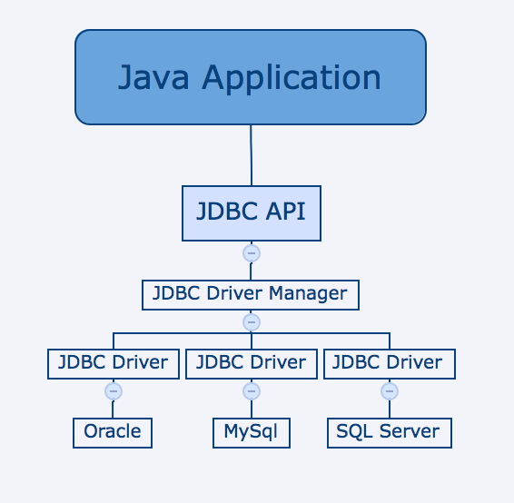

### JDBC概述和CRUD

#### 

#### 课程回顾

```
1、SQL语言数据的完整性
2、多表查询
3、多表查询操作
```

#### 今日内容

```
1、JDBC简介
2、JDBC执行DQL语句
3、JDBC执行DML语句
4、JDBC的Connection、Statement、ResultSet
5、PreparedStatement的使用
```

#### 教学目标

```
1、了解JDBC简介
2、掌握JDBC执行DQL语句
3、掌握JDBC执行DML语句
4、了解什么是SQL注入
5. 掌握PreparedStatement的使用
```

#### 第八章 关于JDBC的简介

##### 8.1 简介

JDBC（Java DataBase Connectivity,java数据库连接）是一种用于执行SQL语句的Java API，可以为多种关系数据库提供统一访问，它由一组用Java语言编写的类和接口组成。JDBC提供了一种基准，据此可以构建更高级的工具和接口，使数据库开发人员能够编写数据库应用程序。

Java 具有坚固、安全、易于使用、易于理解和可从网络上自动下载等特性，是编写数据库应用程序的杰出语言。所需要的只是 Java应用程序与各种不同数据库之间进行对话的方法。

JDBC可以在各种平台上使用Java，如Windows，Mac OS和各种版本的UNIX。

JDBC库包括通常与数据库使用相关的下面提到的每个任务的API。

- 连接数据库。
- 创建SQL或MySQL语句。
- 在数据库中执行SQL或MySQL查询。
- 查看和修改生成的记录。

##### 8.2 JDBC体系结构

JDBC API支持用于数据库访问的两层和三层处理模型，但通常，JDBC体系结构由两层组成：

- **JDBC API：**这提供了应用程序到JDBC管理器连接。
- **JDBC驱动程序API：**这支持JDBC管理器到驱动程序连接。

JDBC API使用驱动程序管理器和特定于数据库的驱动程序来提供与异构数据库的透明连接。



#####        8.3 JDBC核心组件

​    **DriverManager：** 此类管理数据库驱动程序列表。使用通信子协议将来自java应用程序的连接请求与适当的数据库驱动程序匹配。

​    **Driver**:此接口处理与数据库服务器的通信，我们很少会直接与Driver对象进行交互。而是使用DriverManager对象来管理这种类型的对象。

​    **Connection：**该接口具有用于联系数据库的所有方法。连接对象表示通信上下文，即，与数据库的所有通信仅通过连接对象。

​    **Statement**：使用从此接口创建的对象将SQL语句提交到数据库。除了执行存储过程之外，一些派生接口还接受参数。

​    **ResultSet：**在使用Statement对象执行SQL查询后，这些对象保存从数据库检索的数据。它作为一个迭代器，允许我们移动其数据。

​    **SQLException：**此类处理数据库应用程序中发生的任何错误


#### 第九章 JDBC相关的SQL语法

#####     9.1 CRUD语法介绍

​             SQL 是一种标准化的语言，它允许你在数据库上执行操作，如创建项目，查询内容，更新内容，并删除条目等操作。

​           Create, Read, Update, and Delete 通常称为CRUD操作。

CREATE DATABASE语句用于创建新的数据库：

```sql
SQL> CREATE DATABASE DATABASE_NAME;
```

DROP DATABASE语句用于删除现有数据库：

```sql
SQL> DROP DATABASE DATABASE_NAME;
```

CREATE TABLE语句用于创建新表。语法是 -

```sql
SQL> CREATE TABLE Employees
(
   id INT NOT NULL,
   age INT NOT NULL,
   first VARCHAR(255),
   last VARCHAR(255),
   PRIMARY KEY ( id )
);
```

DROP TABLE语句用于删除现有表。

```
SQL> DROP TABLE table_name;
```

INSERT的语法类似于以下内容，其中column1，column2等表示要显示在相应列中的新数据 

```
SQL> INSERT INTO table_name VALUES (column1, column2, ...);
```

SELECT语句用于从数据库中检索数据。SELECT的语法是 -

```
SQL> SELECT column_name, column_name, ...
     FROM table_name
     WHERE conditions;
```

WHERE子句可以使用比较运算符，例如=，！=，<，>，<=和> =，以及BETWEEN和LIKE运算符。

UPDATE语句用于更新数据。

```
SQL> UPDATE table_name
     SET column_name = value, column_name = value, ...
     WHERE conditions;
```

WHERE子句可以使用比较运算符，例如=，！=，<，>，<=和> =，以及BETWEEN和LIKE运算符。

DELETE语句用于从表中删除数据。

```
SQL> DELETE FROM table_name WHERE conditions;
```

WHERE子句可以使用比较运算符，例如=，！=，<，>，<=和> =，以及BETWEEN和LIKE运算符。


#### 第十章 JDBC初始

##### 10.1 使用步骤

构建JDBC应用程序涉及以下六个步骤：

- **导入JDBC驱动包：**需要下载包含数据库编程所需的JDBC的jar包。
- **注册JDBC驱动程序：**要求您初始化驱动程序，以便您可以打开与数据库的通信通道。
- **打开连接：**需要使用*DriverManager.getConnection（）*方法创建一个Connection对象，该对象表示与数据库的物理连接。
- **执行查询：**需要使用类型为Statement的对象来构建和提交SQL语句到数据库。
- **从结果集中提取数据：**需要使用相应的*ResultSet.getXXX（）*方法从结果集中检索数据。
- **释放资源：**需要明确地关闭所有数据库资源，而不依赖于JVM的垃圾收集。

（1）导入jar包,在项目下创建lib目录，把mysql的jdbc包放入此目录总，并添加到build path中。

（2）注册驱动

第一种方式（推荐写法）：**Class.forName()**

注册驱动程序最常见的方法是使用Java的**Class.forName（）**方法，将驱动程序的类文件动态加载到内存中，并将其自动注册

~~~java
try {
   Class.forName("oracle.jdbc.driver.OracleDriver");
}
catch(ClassNotFoundException ex) {
   System.out.println("Error: unable to load driver class!");
   System.exit(1);
}
~~~

第二种方式：是使用静态**DriverManager.registerDriver（）**方法。

~~~java
try {
   Driver myDriver = new com.mysql.jdbc.Driver();
   DriverManager.registerDriver( myDriver );
}
catch(ClassNotFoundException ex) {
   System.out.println("Error: unable to load driver class!");
   System.exit(1);
}

 * 1>驱动程序注册两次
 * 2>java程序依赖mysql驱动包
~~~

（3）获取连接

​	3.1数据库URL配置

加载驱动程序后，可以使用**DriverManager.getConnection（）**方法建立连接。为了方便参考，让我列出三个重载的DriverManager.getConnection()方法 -

- getConnection（String url）
- getConnection（String url，Properties prop）
- getConnection（String url，String user，String password）

| RDBMS  | JDBC驱动程序名称                      | 网址格式                                     |
| ------ | ------------------------------- | ---------------------------------------- |
| MySQL的 | com.mysql.jdbc.Driver           | **jdbc：mysql：//**hostname:3306 / databaseName |
| ORACLE | oracle.jdbc.driver.OracleDriver | **jdbc：oracle：thin：@** hostname：port Number：databaseName |
| DB2    | COM.ibm.db2.jdbc.net.DB2Driver  | **jdbc：db2：**hostname：port Number / databaseName |
| SYBASE | com.sybase.jdbc.SybDriver       | **jdbc：sybase：Tds：** hostname：port Number / databaseName |

​	3.2 创建数据库连接对象

~~~java
String URL = "jdbc:mysql://localhost:3306/EMP";
String USER = "root";
String PASS = "root"
Connection conn = DriverManager.getConnection(URL, USER, PASS);
~~~

（4）执行查询（暂不执行，下一章内容）

（5）处理结果（暂不处理，下一章内容）

（6）关闭数据库连接

为确保连接关闭，您可以在代码中提供一个“finally”块。finally块总是执行，不管是否发生异常。

要关闭上面打开的连接，你应该调用close（）方法如下 -

```java
conn.close();
```

#### 第十一章 JDBC执行SQL语句

一旦获得了连接，我们可以与数据库进行交互。JDBC Statement和PreparedStatement接口定义了使您能够发送SQL命令并从数据库接收数据的方法和属性。

| 接口                      | 使用                                       |
| ----------------------- | ---------------------------------------- |
| Statement               | 用于对数据库进行通用访问。在运行时使用静态SQL语句时很有用。Statement接口不能接受参数。 |
| PreparedStatement(推荐使用) | 当您计划多次使用SQL语句时使用。PreparedStatement接口在运行时接受输入参数。 |

##### 11.1 Statement

创建语句对象

在使用Statement对象执行SQL语句之前，需要使用Connection对象的createStatement（）方法创建一个，如下例所示：

```java
Statement stmt = null;
try {
   stmt = conn.createStatement( );
   . . .
}
catch (SQLException e) {
   . . .
}
finally {
   . . .
}
```

创建Statement对象后，您可以使用它来执行一个SQL语句，其中有三个执行方法之一。

- **boolean execute（String SQL）**：如果可以检索到ResultSet对象，则返回一个布尔值true; 否则返回false。使用此方法执行SQL DDL语句或需要使用真正的动态SQL时。
- **int executeUpdate（String SQL）**：返回受SQL语句执行影响的行数。使用此方法执行预期会影响多个行的SQL语句，例如INSERT，UPDATE或DELETE语句。
- **ResultSet executeQuery（String SQL）**：返回一个ResultSet对象。当您希望获得结果集时，请使用此方法，就像使用SELECT语句一样。

**关闭Statement对象**

就像我们关闭一个Connection对象以保存数据库资源一样，由于同样的原因，还应该关闭Statement对象。

一个简单的调用close（）方法将执行该作业。如果先关闭Connection对象，它也会关闭Statement对象。但是，应始终显式关闭Statement对象，以确保正确清理。

```java
Statement stmt = null;
try {
   stmt = conn.createStatement( );
   . . .
}
catch (SQLException e) {
   . . .
}
finally {
   stmt.close();
}
```

##### 11.4 ResultSet

SELECT语句是从数据库中选择行并在结果集中查看行的标准方法。该*java.sql.ResultSet中的*接口表示结果集数据库查询。

ResultSet对象维护指向结果集中当前行的游标。术语“结果集”是指包含在ResultSet对象中的行和列数据。

如果没有指定任何ResultSet类型，您将自动获得一个TYPE_FORWARD_ONLY。


| 类型                                | 描述                                      |
| --------------------------------- | --------------------------------------- |
| ResultSet.TYPE_FORWARD_ONLY       | 光标只能在结果集中向前移动。                          |
| ResultSet.TYPE_SCROLL_INSENSITIVE | 光标可以向前和向后滚动，结果集对创建结果集后发生的数据库的其他更改不敏感。   |
| ResultSet.TYPE_SCROLL_SENSITIVE。  | 光标可以向前和向后滚动，结果集对创建结果集之后发生的其他数据库所做的更改敏感。 |

演示案例1：查询数据

```java
public class JdbcDemo2 {
	public static void main(String[] args) {
		Connection connection=null;
		Statement stat=null;
		ResultSet rs=null;
		//2注册驱动
		try {
			Class.forName("com.mysql.jdbc.Driver");
			//3获取连接
			connection=DriverManager.getConnection("jdbc:mysql://localhost:3306/school", "root", "root");
			//4创建命令（语句）对象
			stat=connection.createStatement();
			//执行命令查询
			rs=stat.executeQuery("select ename,empno from emp");
			//5处理结果
			while(rs.next()){
//				 int empno=rs.getInt(1);
//				 String empname=rs.getString(2);
				 int empno=rs.getInt("empno");
				 String empname=rs.getString("ename");
				 System.out.println(empno+"...."+empname);
			}
		} catch (Exception e) {
			// TODO Auto-generated catch block
			e.printStackTrace();
		}finally {
			if(rs!=null){
				try {
					rs.close();
				} catch (SQLException e) {
					// TODO Auto-generated catch block
					e.printStackTrace();
				}
			}
			if(stat!=null){
				try {
					stat.close();
				} catch (SQLException e) {
					// TODO Auto-generated catch block
					e.printStackTrace();
				}
			}
			if(connection!=null){
				try {
					connection.close();
				} catch (SQLException e) {
					// TODO Auto-generated catch block
					e.printStackTrace();
				}
			}
		}
	}
}

```


演示案例2：添加数据

```java
public class JdbcDemo3 {
	public static void main(String[] args) {
		Connection connection=null;
		Statement stat=null;
		//2 注册驱动
		try {
			Class.forName("com.mysql.jdbc.Driver");
			//3打开连接
			connection=DriverManager.getConnection("jdbc:mysql://localhost:3306/school", "root", "root");
			//4创建命令并执行
			stat=connection.createStatement();
			int result=stat.executeUpdate("insert into dept(deptno,dname,loc) values(80,'市场部','天津')");
			if(result>0){
				System.out.println("添加成功");
			}else{
				System.out.println("添加失败");
			}
			
		} catch (Exception e) {
			// TODO Auto-generated catch block
			e.printStackTrace();
		}finally {
			if(stat!=null){
				try {
					stat.close();
				} catch (SQLException e) {
					// TODO Auto-generated catch block
					e.printStackTrace();
				}
			}
			if(connection!=null){
				try {
					connection.close();
				} catch (SQLException e) {
					// TODO Auto-generated catch block
					e.printStackTrace();
				}
			}
		}
	}
}

```


演示案例3：更新|删除数据

```java
public class JdbcDemo4 {
	public static void main(String[] args) {
		Connection connection=null;
		Statement stat=null;
		//2 注册驱动
		try {
			Class.forName("com.mysql.jdbc.Driver");
			//3打开连接
			connection=DriverManager.getConnection("jdbc:mysql://localhost:3306/school", "root", "root");
			//4创建命令并执行
			stat=connection.createStatement();
			int result=stat.executeUpdate("update dept set loc='内蒙' where deptno=80");
			if(result>0){
				System.out.println("更新成功");
			}else{
				System.out.println("更新失败");
			}
			
		} catch (Exception e) {
			// TODO Auto-generated catch block
			e.printStackTrace();
		}finally {
			if(stat!=null){
				try {
					stat.close();
				} catch (SQLException e) {
					// TODO Auto-generated catch block
					e.printStackTrace();
				}
			}
			if(connection!=null){
				try {
					connection.close();
				} catch (SQLException e) {
					// TODO Auto-generated catch block
					e.printStackTrace();
				}
			}
		}
	}
}

```


演示案例4：实现用户登录

```java
public class JdbcDemo5 {
	public static void main(String[] args) {
		Connection connection=null;
		Statement stat=null;
		//2 注册驱动
		try {
			Class.forName("com.mysql.jdbc.Driver");
			//3打开连接
			connection=DriverManager.getConnection("jdbc:mysql://localhost:3306/school", "root", "root");
			//4创建命令并执行
			stat=connection.createStatement();
			int result=stat.executeUpdate("delete from dept where deptno=80");
			if(result>0){
				System.out.println("删除成功");
			}else{
				System.out.println("删除失败");
			}
			
		} catch (Exception e) {
			// TODO Auto-generated catch block
			e.printStackTrace();
		}finally {
			if(stat!=null){
				try {
					stat.close();
				} catch (SQLException e) {
					// TODO Auto-generated catch block
					e.printStackTrace();
				}
			}
			if(connection!=null){
				try {
					connection.close();
				} catch (SQLException e) {
					// TODO Auto-generated catch block
					e.printStackTrace();
				}
			}
		}
	}
}

```


##### 11.2 SQL注入

就是通过把SQL命令插入到Web表单提交或输入域名或页面请求的查询字符串，最终达到欺骗服务器执行恶意的SQL命令。具体来说，它是利用现有应用程序，将（恶意的）SQL命令注入到后台数据库引擎执行的能力，它可以通过在Web表单中输入（恶意）SQL语句得到一个存在安全漏洞的网站上的数据库，而不是按照设计者意图去执行SQL语句。比如先前的很多影视网站泄露VIP会员密码大多就是通过WEB表单递交查询字符暴出的，这类表单特别容易受到SQL注入式攻击。


##### 11.3 PreparedStatement

该*PreparedStatement的*接口扩展了Statement接口，它为您提供了一个通用的Statement对象有两个优点附加功能。

此语句使您可以动态地提供参数。

~~~java
PreparedStatement pstmt = null;
try {
   String SQL = "Update Employees SET age = ? WHERE id = ?";
   pstmt = conn.prepareStatement(SQL);
   . . .
}
catch (SQLException e) {
   . . .
}
finally {
   . . .
}
~~~

JDBC中的所有参数都由**？**符号，这被称为参数标记。在执行SQL语句之前，必须为每个参数提供值。

所述**的setXXX（）**方法将值绑定到所述参数，其中**XXX**代表要绑定到输入参数的值的Java数据类型。如果忘记提供值，将收到一个SQLException。

每个参数标记由其顺序位置引用。第一个标记表示位置1，下一个位置2等等。该方法与Java数组索引不同，从0开始。

**关闭PreparedStatement对象**

就像关闭Statement对象一样，由于同样的原因，还应该关闭PreparedStatement对象。

一个简单的调用close（）方法将执行该作业。如果先关闭Connection对象，它也会关闭PreparedStatement对象。但是，应始终显式关闭PreparedStatement对象，以确保正确清理。

```java
PreparedStatement pstmt = null;
try {
   String SQL = "Update Employees SET age = ? WHERE id = ?";
   pstmt = conn.prepareStatement(SQL);
   . . .
}
catch (SQLException e) {
   . . .
}
finally {
   pstmt.close();
}
```


#### 总结


#### 作业题

```
1.登录
	创建user表
		id int 主键 自增
		username varchar
		password varchar
	创建user_leaf 用户个人信息表
		id int 主键 自增
		name
		age
		sex
		u_id 外键
		
	控制台输入用户名 密码
	连接数据库 判断和数据库里的是否一致
	一致 显示 登录成功 不一致 显示登陆失败
扩展 如登录成功
	显示user个人信息表信息
2.根据id查询指定的学生记录
	创建学生信息表	创建方法 传入学生id 获取学生信息
	student 表 
	sid(int 主键 自增) 
	sname(varchar 非空) 
	sage(int 默认值为10) 
	ssex(varchar) 
	birthday(date) 
	score(double 保留小数点后2位)
扩展 1.将 score单独存储到student_s表中
	一对多关系
	将数据存储到合适的集合中 遍历结合获取数据
     2.将集合中的数据 写出到student.txt文件中 以逗号分隔
```

#### 面试题

```
有如下两张表：【中等难度】
表city： 表state：
CityNo CityName StateNo
BJ 北京（Null）
SH 上海（Null）
GZ 广州GD
DL 大连LN
欲得
到如下结果： City
No City Name State No State Name BJ
北京（Null） （Null） DL
大连LN 辽宁GZ
广州GD 广东SH
上海（Null） （Null） 写相
应的SQL 语句。
```
